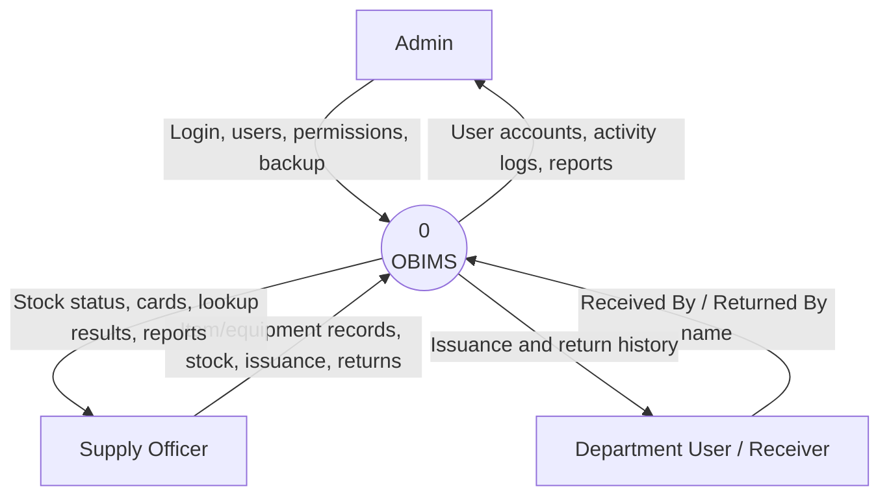
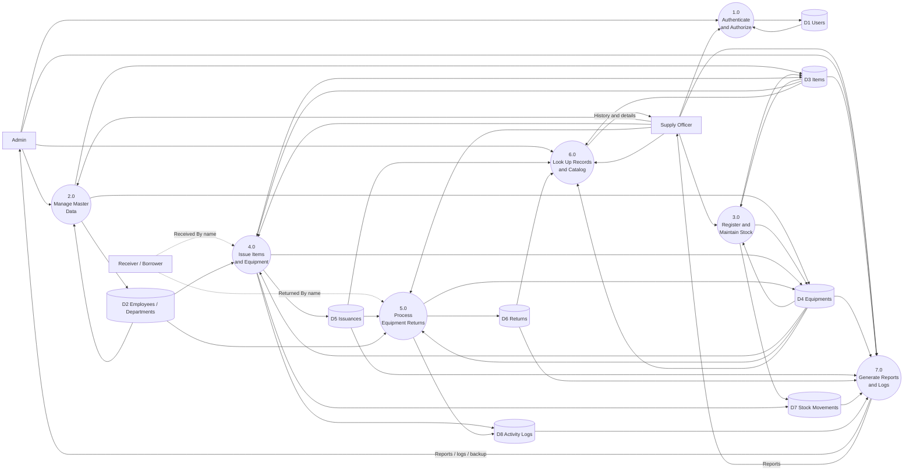
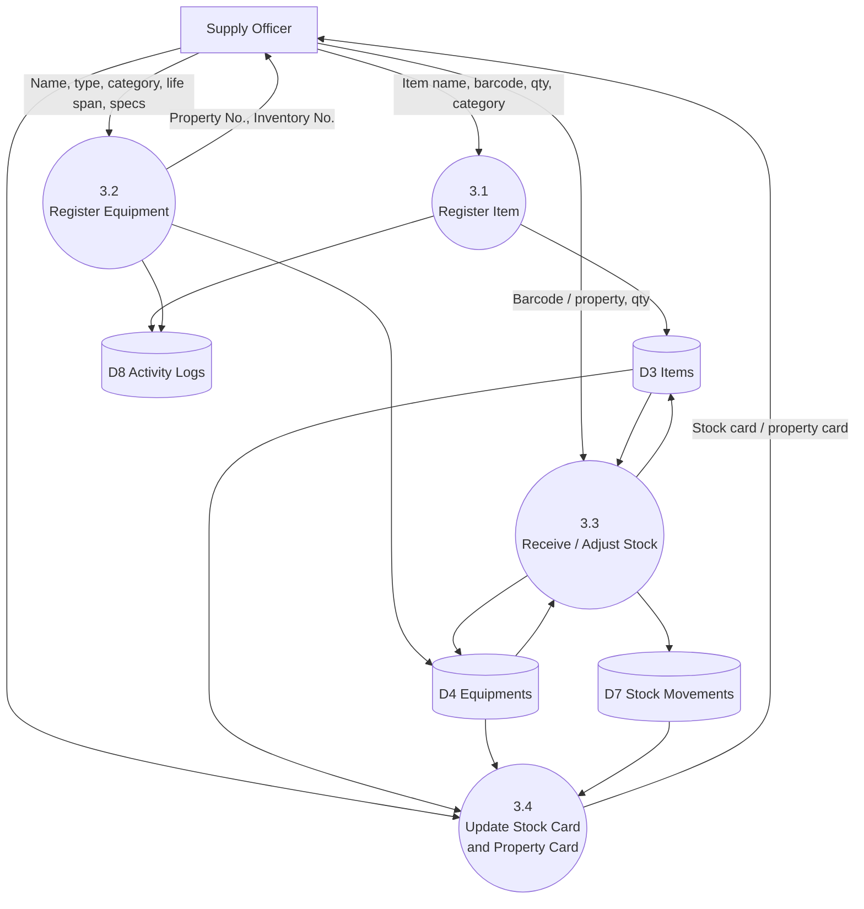
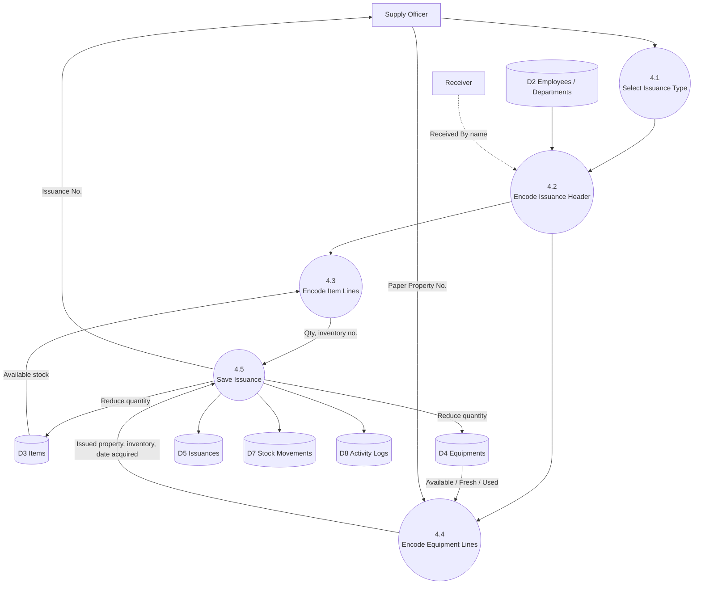
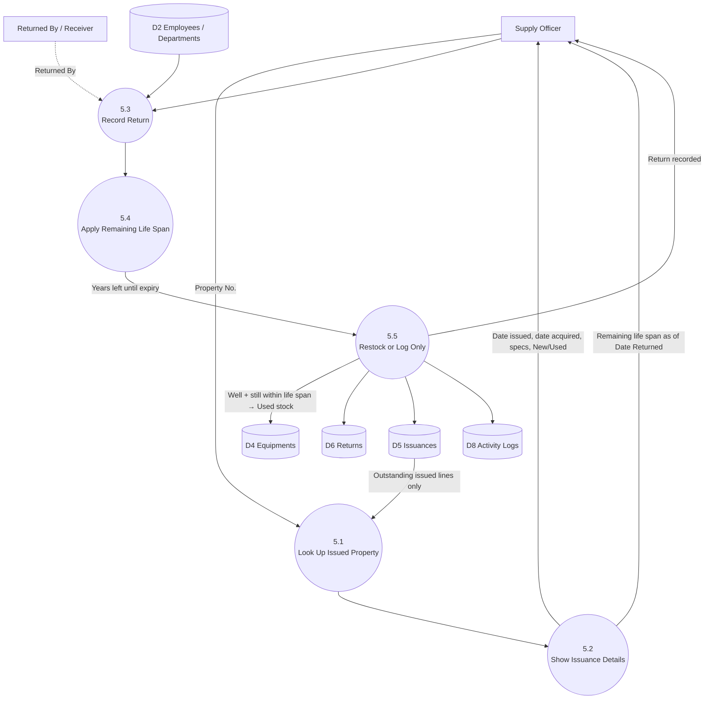
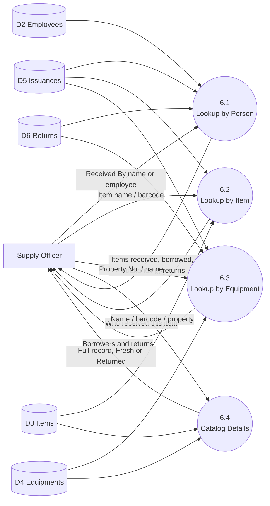
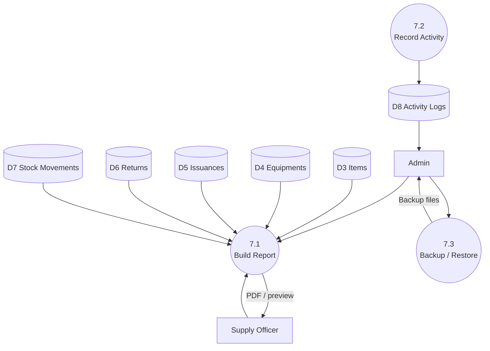
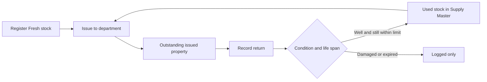

# OBIMS Data Flow Diagram (DFD)

**System:** Online Barcode Inventory Management System (OBIMS)  
**Organization:** Department of Education — Supply Unit  
**Notation:** Gane–Sarson style (external entity, process, data store, data flow)

## Lucidchart (import)

The editable diagrams are in **[OBIMS-DFD.drawio](OBIMS-DFD.drawio)** (same folder). Lucidchart imports this format.

1. Go to [lucid.app](https://lucid.app) and sign in.
2. **File → Import** (or **+ New → Import**).
3. Upload `docs/OBIMS-DFD.drawio`.
4. Each tab in Lucidchart is a page: Context, Diagram 0, Stock 3.0, Issuance 4.0, Returns 5.0, Inventory Cycle.

You can also open the same file in [diagrams.net](https://app.diagrams.net) (**File → Open from → Device**).

Mermaid versions below are for preview in GitHub / VS Code. Use the `.drawio` file as the source for Lucidchart.

---

## Legend

| Symbol | Meaning |
| --- | --- |
| Rectangle | External entity (person or office outside the system) |
| Rounded box | Process (work the system performs) |
| Cylinder | Data store (database table / file) |
| Arrow | Data flow (information moving in that direction) |

---

## 1. Context Diagram (Level 0)

The context diagram shows OBIMS as one process and the people who send data in or receive data out.

**External entities**

- **Admin** — manages users, permissions, deleted data, and backups.
- **Supply Officer** — registers supplies, issues stock, records returns, and prints reports.
- **Department User / Receiver** — the person who receives or returns property; history is looked up by name.

---

## 2. Diagram 0 (Level 1)

This level splits OBIMS into the main processes used every day.

### Process list (Level 1)

| No. | Process | Description |
| --- | --- | --- |
| 1.0 | Authenticate and Authorize | Login, session, role, and page permissions |
| 2.0 | Manage Master Data | Departments, employees, categories, units, locations, settings |
| 3.0 | Register and Maintain Stock | Register items/equipment, receive, adjust, stock/property cards |
| 4.0 | Issue Items and Equipment | Encode hard-copy issuance; update stock and outstanding property |
| 5.0 | Process Equipment Returns | Look up issued property; record well/damaged return; restock Used units |
| 6.0 | Look Up Records and Catalog | Person (Received By), item, equipment, catalog details |
| 7.0 | Generate Reports and Logs | Reports, activity logs, notifications, backup files |

### Data stores (Level 1)

| ID | Store | Main tables |
| --- | --- | --- |
| D1 | Users | `users` |
| D2 | Employees / Departments | `employees`, `departments` |
| D3 | Items | `items`, `categories`, `units`, `storage_locations` |
| D4 | Equipments | `equipments`, `equipment_categories` |
| D5 | Issuances | `issuances`, `issuance_details` |
| D6 | Returns | `returns` |
| D7 | Stock Movements | `stock_movements` |
| D8 | Activity Logs | `activity_logs` |

---

## 3. Level 2 — Process 3.0 Register and Maintain Stock

**Notes**

- New equipment is tagged **Fresh** (first-time supply stock).
- Barcode, property number, and inventory number identify records in Supply Master.

---

## 4. Level 2 — Process 4.0 Issue Items and Equipment

**Equipment issuance rules captured in the flow**

- **New (Fresh):** Property No. must be changed from the Supply Master default to the number on the paper form.
- **Used (Returned):** Officer decides whether to keep or change Property No.
- Inventory No. is optional for equipment.
- Original Supply Master listing is not overwritten; issued numbers are stored on the issuance line.

---

## 5. Level 2 — Process 5.0 Process Equipment Returns

**Return rules captured in the flow**

- Search is limited to **outstanding issued** property numbers, not Available Supply Master stock.
- Remaining life span updates when **Date Returned** changes.
- **Returned well** before the life-span limit creates a separate **Used** equipment record.
- **Damaged** or **life span reached** is logged only and is not added back for re-issue.
- Custom Equipment (past data) is used when the return is not in issuance history.

---

## 6. Level 2 — Process 6.0 Look Up Records and Catalog

Person lookup searches both **employees** and **typed Received By** names stored on issuances.

---

## 7. Level 2 — Process 7.0 Generate Reports and Logs

---

## 8. End-to-end data path (summary)

This is the main inventory cycle in OBIMS: **Fresh stock → Issuance → Return → Used stock (if still usable) → can be issued again**.

---

## 9. How this maps to the application

| DFD process | Screens / modules |
| --- | --- |
| 1.0 Authenticate | Login, Profile, Permissions |
| 2.0 Master data | Departments, Employees, Settings / Master Data, Users |
| 3.0 Stock | Registration, Supply Master, Stock Operations, Stock Card, Property Card |
| 4.0 Issuance | Item Issuance |
| 5.0 Returns | Equipment Returns |
| 6.0 Lookup | Records Lookup, Catalog Details |
| 7.0 Reports | Reports, Activity Logs, Backup Files, Estimated Stock |
